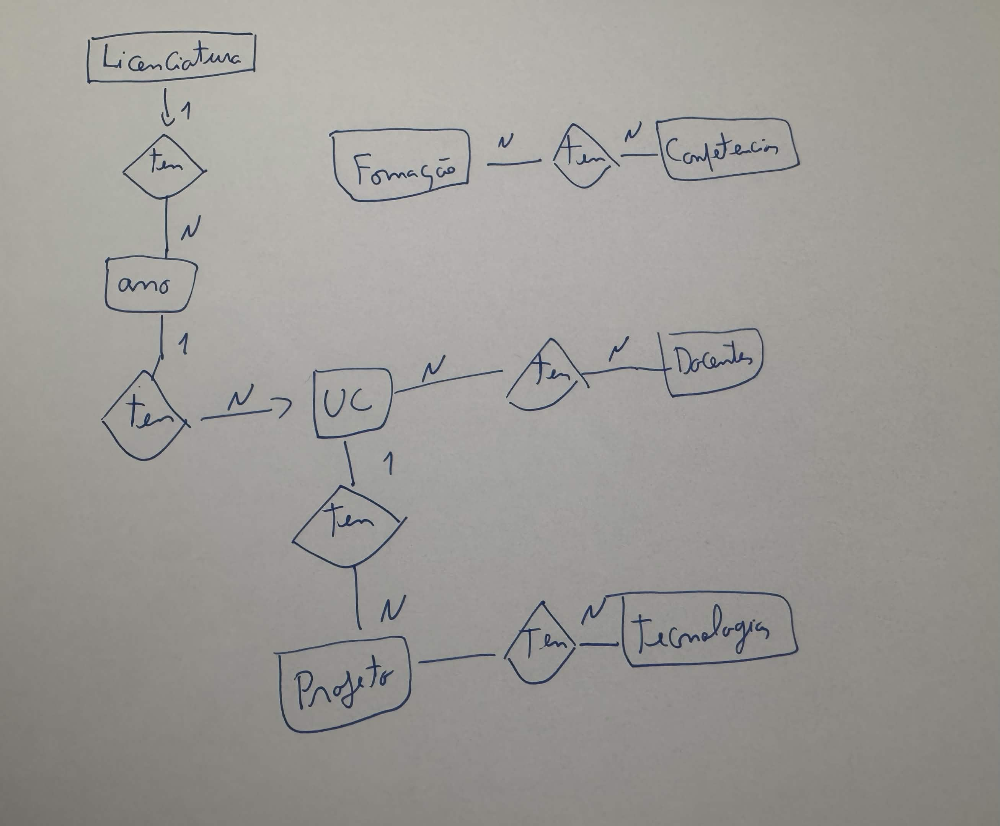

# Making Of

Numa fase inicial, comecei por definir as entidades e os seus atributos, com base na ideia de representar o meu percurso académico de forma organizada.

### Entidades e atributos:

**Licenciatura**
- nome  
- sigla  
- descricao  
- duracao_anos  
- universidade  

**Ano**
- ano  
- licenciatura (relação com Licenciatura)  

**UnidadeCurricular**
- nome  
- codigo  
- ano (relação com Ano)  
- semestre  
- descricao  
- ects  
- image  

**Docente**
- nome  
- email  
- cardCode  
- regimen  
- degree  
- pagina_lusofona  

**Projeto**
- titulo  
- descricao  
- conceitos_aplicados  
- github_url  
- image  
- uc (relação com Unidade Curricular)  

**Tecnologia**
- nome  
- descricao  
- website  
- image  

**Competencia**
- nome  
- tipo  
- descricao  
- tecnologias (relação com Tecnologia)  

**Formacao**
- nome  
- entidade  
- descricao  
- certificado_url  
- competencias (relação com Competencia)  

**TFC**
- titulo  
- autor  
- email  
- orientador  
- licenciatura  
- pdf  
- image  
- descricao  
- area  
- palavras_chaves  
- tecnologias  
- classificacao  

**MakingOf**
- titulo  
- descricao  
- ficheiro  

---

Ao longo do desenvolvimento, estas entidades foram sendo ajustadas, principalmente quando comecei a trabalhar com os dados dos ficheiros JSON. Alguns atributos foram adicionados, outros alterados, e algumas relações melhoradas para tornar o modelo mais coerente e completo.

---

## Planeamento Inicial

Antes de começar a programar, fiz alguns esquemas em papel para organizar as ideias e perceber que entidades precisava. A intenção era criar um sistema que representasse o meu percurso académico de forma estruturada, e não apenas um conjunto de páginas soltas.

Inicialmente, pensei em entidades como Licenciatura, Ano, Unidade Curricular, Docente e Projeto. No entanto, nesta fase o modelo era bastante simples e ainda não tinha em conta a complexidade dos dados.

---

## Primeira Versão do Modelo

Quando comecei a implementar em Django, criei uma estrutura base com relações simples. A hierarquia principal ficou organizada como:

Licenciatura → Ano → Unidade Curricular

Esta decisão ajudou-me a organizar o curso de forma lógica. Também liguei os projetos às UCs e comecei a introduzir docentes.

No entanto, rapidamente percebi que o modelo estava incompleto. Faltavam ligações importantes e não estava preparado para receber toda a informação disponível nos ficheiros JSON.

---

## Evolução do Modelo

À medida que fui analisando os dados, tive de fazer várias alterações ao modelo.

Na entidade **Licenciatura**, percebi que fazia sentido incluir mais contexto, como o nome da universidade e a duração do curso. Isto permitiu tornar o sistema mais completo e preparado para evoluir no futuro.

Na entidade **Ano**, mantive uma estrutura simples com ligação à licenciatura. Esta parte não teve grandes problemas, mas foi essencial para garantir organização.

A entidade **Unidade Curricular** foi uma das que mais alterações sofreu. Inicialmente tinha poucos atributos, mas depois percebi que precisava de incluir mais informação. Um dos erros foi ter definido o semestre como número, quando os dados vinham como texto (por exemplo, "1º Semestre"). Tive de corrigir isso para um campo de texto. Também adicionei o campo ECTS e passei a ir buscar a descrição completa aos ficheiros JSON individuais de cada UC, o que melhorou bastante a qualidade dos dados.

Na entidade **Docente**, comecei com poucos atributos, mas ao analisar os dados percebi que existia informação mais detalhada. Adicionei campos como `cardCode`, `regimen` e `degree`. Também corrigi o tipo do campo email para `EmailField`, pois inicialmente não estava definido da forma mais adequada.

A entidade **Projeto** foi pensada como algo ligado a uma UC. Com o tempo, percebi que fazia sentido associar tecnologias aos projetos. Para isso, utilizei uma relação ManyToMany, o que permitiu representar melhor a realidade. Esta foi uma melhoria importante na organização dos dados.

A entidade **Tecnologia** surgiu precisamente para evitar repetição de informação. Em vez de escrever tecnologias em texto em vários sítios, passei a ter uma entidade própria. Isto tornou o sistema mais consistente.

A entidade **Competencia** foi adicionada para representar conhecimentos adquiridos ao longo do curso. Decidi ligá-la às tecnologias, pois muitas competências estão diretamente relacionadas com ferramentas utilizadas.

A entidade **Formacao** foi adicionada numa fase posterior, quando percebi que o portefólio não devia incluir apenas o percurso académico, mas também formações externas. Isto tornou o sistema mais completo.

A entidade **TFC** foi uma das mais influenciadas pelos dados. Inicialmente era muito simples, mas após analisar o ficheiro `tfcs.json`, percebi que estava a perder muita informação. Adicionei campos como email, PDF, imagem, palavras-chave, tecnologias e classificação. Um dos ajustes importantes foi usar um `FloatField` para a classificação, para representar corretamente os valores.

Na entidade **MakingOf**, comecei com uma ideia simples, mas depois percebi que precisava de guardar diferentes tipos de ficheiros (imagens, PDFs, etc.). Por isso, alterei o campo para `FileField`, permitindo maior flexibilidade. Também incluí uma descrição para explicar cada registo.

---

## Automação com Loaders

Para evitar inserir dados manualmente, criei scripts para automatizar o processo.

O `loader.py` foi o mais complexo. Este script cria a licenciatura, os anos, os docentes e as unidades curriculares. Um dos maiores desafios foi conseguir ler vários ficheiros JSON e ir buscar a descrição correta de cada UC a partir de ficheiros individuais.

O `loadertfc.py` foi mais direto, sendo responsável por carregar os dados dos TFCs a partir de um ficheiro JSON. Apesar de mais simples, foi importante para garantir consistência e rapidez no carregamento de dados.

---

## Utilização de Inteligência Artificial

A IA foi útil para perceber melhor certos conceitos, especialmente na parte dos loaders, onde tive dúvidas sobre como ligar corretamente uma Unidade Curricular à Licenciatura e ao respetivo Ano. Isso ajudou-me a organizar melhor as relações entre os modelos e a garantir que os dados ficavam bem estruturados na base de dados.

